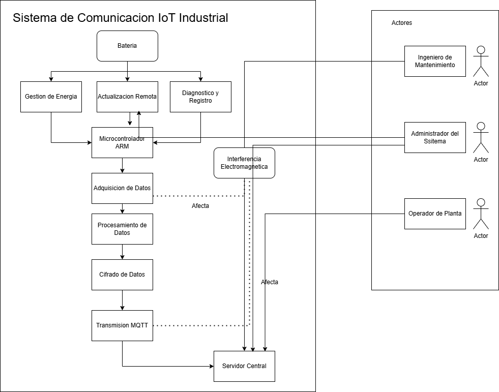

# Sistema de Comunicación IoT Industrial

## Descripción

Este repositorio contiene la Especificación de Requisitos de Software (SRS) para el firmware de un sistema de comunicación inalámbrica en un entorno industrial IoT. El sistema está diseñado para conectar sensores remotos en una planta de manufactura con un servidor central para monitoreo y análisis en tiempo real.

## Propósito del Proyecto

Desarrollar un firmware robusto para microcontroladores ARM de bajo consumo que permita:

- Adquisición y procesamiento de datos desde múltiples tipos de sensores
- Transmisión segura mediante protocolo MQTT
- Operación fiable en entornos con interferencia electromagnética
- Optimización del consumo energético para prolongar la vida útil de las baterías

## Requisitos Principales

### Requisitos Funcionales

- **Adquisición de Datos**: Muestreo configurable de múltiples tipos de sensores
- **Procesamiento de Datos**: Conversión, calibración y compresión de datos
- **Implementación MQTT**: Comunicación bidireccional con el servidor central
- **Cifrado de Datos**: Mecanismos de seguridad para proteger la información
- **Gestión de Energía**: Alternancia entre modos de bajo consumo y activo
- **Actualización Remota**: Capacidad de actualizar el firmware de forma segura
- **Diagnóstico y Registro**: Monitoreo del estado del sistema y registro de eventos

### Requisitos No Funcionales

- **Rendimiento**: Latencia máxima de 500 ms, 10 mensajes/segundo
- **Confiabilidad**: Disponibilidad del 99.9%
- **Seguridad**: Cifrado AES-128 o superior
- **Eficiencia Energética**: Vida útil de batería de al menos 6 meses
- **Escalabilidad**: Soporte para hasta 10 sensores por nodo
- **Resistencia a Interferencias**: Operación en entornos industriales hostiles

# Documento de Requisitos de Software (SRS)

## Sistema de Comunicación IoT Industrial

### 1. Introducción y Alcance

#### 1.1 Propósito

Este documento especifica los requisitos de software para el firmware de un sistema de comunicación inalámbrica en un entorno industrial IoT. El propósito principal es establecer las bases técnicas y funcionales para el desarrollo del firmware que permitirá la comunicación eficiente entre sensores remotos en una planta de manufactura y el servidor central.

#### 1.2 Alcance

El firmware será implementado en microcontroladores ARM de bajo consumo distribuidos en sensores remotos dentro de la planta de manufactura. El sistema permitirá la recolección, procesamiento y transmisión de datos en tiempo real, optimizando el mantenimiento preventivo y reduciendo los tiempos de respuesta ante fallas en la planta.

#### 1.3 Definiciones, Acrónimos y Abreviaturas

- **IoT**: Internet de las Cosas (Internet of Things)
- **MQTT**: Message Queuing Telemetry Transport, protocolo de comunicación
- **ARM**: Advanced RISC Machines, arquitectura de procesador
- **SRS**: Software Requirements Specification (Especificación de Requisitos de Software)
- **RF**: Radiofrecuencia

#### 1.4 Referencias

- Estándares industriales de comunicación inalámbrica
- Documentación técnica de microcontroladores ARM
- Especificaciones del protocolo MQTT
- Normativas de seguridad industrial

#### 1.5 Visión General

Las siguientes secciones detallan la descripción general del sistema, los requisitos funcionales y no funcionales, y las consideraciones de diseño para el firmware del sistema de comunicación IoT industrial.

### 2. Descripción General del Sistema

#### 2.1 Perspectiva del Producto

El firmware forma parte de un sistema integral de monitoreo industrial que busca optimizar la operación de una planta de manufactura mediante la recolección y análisis de datos en tiempo real. El firmware actuará como la capa de software encargada de gestionar la comunicación entre los sensores físicos y el servidor central.

#### 2.2 Funciones del Producto

- Gestionar la adquisición de datos desde sensores industriales
- Procesar y filtrar la información recolectada
- Transmitir datos de forma inalámbrica al servidor central
- Implementar mecanismos de seguridad para la comunicación
- Optimizar el consumo energético de los dispositivos

#### 2.3 Características de los Usuarios

Los usuarios directos del sistema son:

- Ingenieros de mantenimiento: Utilizarán la información del sistema para planificar mantenimientos preventivos.
- Operadores de planta: Recibirán alertas y monitorearán el funcionamiento de los equipos.
- Administradores del sistema: Configurarán y gestionarán el sistema de comunicación.

#### 2.4 Restricciones

- El firmware debe operar en microcontroladores ARM con recursos limitados
- Debe funcionar en ambientes industriales con alta interferencia electromagnética
- Debe cumplir con estándares de seguridad industrial
- Debe optimizar el consumo de energía para maximizar la vida útil de las baterías

#### 2.5 Suposiciones y Dependencias

- Se asume la disponibilidad de hardware con capacidades específicas (memoria, procesamiento)
- El sistema depende de la infraestructura de red inalámbrica existente en la planta
- Se asume la existencia de un servidor central con capacidad para procesar los datos recibidos

### 3. Requisitos Específicos

#### 3.1 Requisitos Funcionales

**RF-01: Adquisición de Datos**

- Descripción: El firmware debe ser capaz de adquirir datos de los sensores conectados al microcontrolador.
- Prioridad: Alta
- Detalles:
  - Debe muestrear datos de múltiples tipos de sensores (temperatura, presión, vibración, etc.)
  - La frecuencia de muestreo debe ser configurable según el tipo de sensor
  - Debe aplicar filtros básicos para eliminar lecturas erróneas

**RF-02: Procesamiento de Datos**

- Descripción: El firmware debe procesar los datos adquiridos antes de su transmisión.
- Prioridad: Alta
- Detalles:
  - Debe realizar conversiones de señales analógicas a valores digitales
  - Debe aplicar algoritmos de calibración específicos para cada tipo de sensor
  - Debe implementar técnicas de compresión de datos para optimizar la transmisión

**RF-03: Implementación de Protocolo MQTT**

- Descripción: El firmware debe implementar el protocolo MQTT para la comunicación con el servidor.
- Prioridad: Alta
- Detalles:
  - Debe establecer y mantener conexiones MQTT con el broker
  - Debe publicar mensajes en los topics correspondientes
  - Debe suscribirse a topics para recibir comandos del servidor central

**RF-04: Corrección de Errores**

- Descripción: El firmware debe implementar algoritmos de corrección de errores para garantizar la integridad de los datos.
- Prioridad: Media
- Detalles:
  - Debe detectar errores de transmisión mediante checksums o códigos CRC
  - Debe implementar mecanismos de retransmisión en caso de errores
  - Debe registrar estadísticas de errores para diagnóstico

**RF-05: Cifrado de Datos**

- Descripción: El firmware debe implementar mecanismos de cifrado para garantizar la seguridad de la información.
- Prioridad: Alta
- Detalles:
  - Debe cifrar los datos utilizando algoritmos adecuados para dispositivos con recursos limitados
  - Debe gestionar claves de cifrado de forma segura
  - Debe permitir la actualización remota de claves de seguridad

**RF-06: Gestión de Energía**

- Descripción: El firmware debe implementar técnicas de gestión de energía para prolongar la vida útil de las baterías.
- Prioridad: Alta
- Detalles:
  - Debe alternar entre modos de operación de bajo consumo y activo
  - Debe ajustar la frecuencia de muestreo y transmisión según el nivel de batería
  - Debe reportar el nivel de batería al servidor central

**RF-07: Actualización Remota**

- Descripción: El firmware debe permitir actualizaciones remotas seguras.
- Prioridad: Media
- Detalles:
  - Debe verificar la integridad y autenticidad de las actualizaciones
  - Debe mantener una copia de seguridad del firmware actual antes de la actualización
  - Debe reportar el resultado del proceso de actualización

**RF-08: Diagnóstico y Registro**

- Descripción: El firmware debe implementar funciones de diagnóstico y registro de eventos.
- Prioridad: Media
- Detalles:
  - Debe mantener un registro de eventos importantes (errores, conexiones, etc.)
  - Debe permitir la recuperación remota de registros
  - Debe implementar mecanismos de autodiagnóstico y reporte de estado

#### 3.2 Requisitos No Funcionales

**RNF-01: Rendimiento**

- Descripción: El firmware debe operar con latencias mínimas para garantizar la transmisión en tiempo real.
- Prioridad: Alta
- Detalles:
  - El tiempo máximo entre la adquisición de datos y su transmisión no debe superar los 500 ms
  - El sistema debe soportar la transmisión de al menos 10 mensajes por segundo
  - El tiempo de inicialización del sistema no debe superar los 2 segundos

**RNF-02: Confiabilidad**

- Descripción: El firmware debe ser altamente confiable incluso en condiciones adversas.
- Prioridad: Alta
- Detalles:
  - Debe tener una tasa de disponibilidad del 99.9%
  - Debe implementar mecanismos de recuperación ante fallos
  - Debe mantener la operación básica incluso en condiciones de batería crítica

**RNF-03: Seguridad**

- Descripción: El firmware debe implementar mecanismos robustos de seguridad.
- Prioridad: Alta
- Detalles:
  - Debe utilizar cifrado AES-128 o superior para proteger los datos
  - Debe implementar autenticación para todas las comunicaciones
  - Debe proteger contra ataques de repetición e inyección

**RNF-04: Eficiencia Energética**

- Descripción: El firmware debe optimizar el uso de energía para maximizar la vida útil de las baterías.
- Prioridad: Alta
- Detalles:
  - El consumo promedio de energía no debe superar los 100mW en modo normal
  - El consumo en modo de espera debe ser inferior a 10mW
  - La vida útil con una batería estándar debe ser de al menos 6 meses

**RNF-05: Escalabilidad**

- Descripción: El firmware debe soportar la incorporación de nuevos sensores y funcionalidades.
- Prioridad: Media
- Detalles:
  - Debe permitir la configuración dinámica de parámetros
  - La arquitectura debe ser modular para facilitar la adición de nuevas funcionalidades
  - Debe soportar hasta 10 sensores diferentes conectados al mismo nodo

**RNF-06: Portabilidad**

- Descripción: El firmware debe ser adaptable a diferentes variantes de microcontroladores ARM.
- Prioridad: Media
- Detalles:
  - El código debe seguir estándares que faciliten su portabilidad
  - Se deben utilizar capas de abstracción de hardware
  - La configuración específica del hardware debe estar aislada

**RNF-07: Mantenibilidad**

- Descripción: El firmware debe ser fácil de mantener y actualizar.
- Prioridad: Media
- Detalles:
  - El código debe estar bien documentado
  - Debe seguir patrones de diseño reconocidos
  - Debe implementarse un sistema de versionado claro

**RNF-08: Resistencia a Interferencias**

- Descripción: El firmware debe operar correctamente en entornos con alta interferencia electromagnética.
- Prioridad: Alta
- Detalles:
  - Debe implementar algoritmos de filtrado para reducir el impacto del ruido electromagnético
  - Debe validar la integridad de los datos antes de procesarlos
  - Debe detectar y reportar condiciones de interferencia extrema

### 4. Suposiciones y Dependencias

#### 4.1 Suposiciones

- Los sensores utilizados son compatibles con los microcontroladores ARM seleccionados
- Existe una infraestructura de red inalámbrica que cubre toda la planta de manufactura
- El servidor central está operativo 24/7 para recibir y procesar los datos
- Los usuarios finales tienen conocimientos técnicos para interpretar los datos

#### 4.2 Dependencias

- Disponibilidad de librerías optimizadas para MQTT en microcontroladores ARM
- Compatibilidad de los algoritmos de cifrado con los recursos disponibles
- Estabilidad de la red inalámbrica en el entorno industrial
- Capacidad del servidor para procesar el volumen de datos generado

### 5. Criterios de Aceptación y Validación

#### 5.1 Criterios de Aceptación

- El firmware debe instalarse correctamente en el hardware objetivo
- Debe establecer comunicación efectiva con el servidor central
- Debe demostrar la transmisión segura de datos en tiempo real
- Debe operar dentro de los parámetros de rendimiento establecidos
- La vida útil de la batería debe cumplir con las especificaciones

#### 5.2 Plan de Validación

- Pruebas de laboratorio simulando condiciones industriales
- Pruebas de campo en la planta de manufactura
- Pruebas de estrés para verificar la respuesta ante situaciones críticas
- Evaluación del consumo energético en diferentes escenarios
- Verificación de la seguridad mediante pruebas de penetración

# Simulación de Interacción con Stakeholders para Validación de Requisitos

## Propósito

Este documento simula las interacciones con diferentes stakeholders durante el proceso de validación de requisitos para el Sistema de Comunicación IoT Industrial. El objetivo es representar cómo se recopilaron las perspectivas de los distintos interesados para refinar y mejorar los requisitos iniciales.

## Participantes en la Simulación

- **Ingenieros de Mantenimiento**: Responsables del mantenimiento preventivo y correctivo en la planta
- **Operadores de Planta**: Personal que supervisa la operación diaria de la maquinaria
- **Administradores del Sistema**: Encargados de gestionar la infraestructura tecnológica
- **Especialistas en Seguridad Industrial**: Responsables de la seguridad y cumplimiento normativo
- **Expertos en Firmware**: Ingenieros especializados en desarrollo de firmware para sistemas embebidos
- **Especialistas en Comunicaciones Inalámbricas**: Expertos en protocolos de comunicación IoT

## Metodología de la Simulación

La simulación se estructuró en tres fases:

1. **Presentación de Requisitos**: Exposición de los requisitos iniciales a cada grupo de stakeholders
2. **Discusión Guiada**: Debate estructurado sobre las fortalezas y debilidades de los requisitos
3. **Captura de Feedback**: Documentación sistemática de sugerencias y preocupaciones

## Simulación de Interacciones

### 1. Sesión con Ingenieros de Mantenimiento

**Presentación**: Se expusieron los requisitos relacionados con la adquisición de datos y transmisión al servidor central.

**Feedback principal**:

> "La frecuencia de muestreo propuesta de 10 muestras por segundo es excesiva para algunos parámetros como temperatura, que no cambia tan rápidamente. Esto podría afectar negativamente la duración de la batería sin aportar valor adicional."

> "Necesitamos que el sistema priorice la transmisión de alertas críticas sobre los datos rutinarios. No veo este requisito claramente definido."

**Ajustes sugeridos**:
- Implementar frecuencias de muestreo variables según el tipo de sensor
- Añadir un sistema de priorización de mensajes en la implementación MQTT
- Incluir capacidad de configurar umbrales de alerta personalizados

### 2. Sesión con Operadores de Planta

**Presentación**: Se expusieron los requisitos relacionados con la interfaz de usuario y alertas.

**Feedback principal**:

> "El tiempo de respuesta de 500ms podría no ser suficiente en situaciones críticas. Preferimos sacrificar algo de duración de batería por mayor velocidad en ciertos sensores críticos de seguridad."

> "Necesitamos algún indicador visual en el dispositivo mismo, no solo alertas en el servidor central. Por ejemplo, un LED que cambie de color cuando hay problemas de comunicación."

**Ajustes sugeridos**:
- Redefinir los requisitos de latencia para diferentes clases de sensores
- Añadir requisito para indicación visual local del estado del dispositivo
- Incluir modos de operación "críticos" con menor latencia y mayor consumo energético

### 3. Sesión con Administradores del Sistema

**Presentación**: Se expusieron los requisitos relacionados con la seguridad, actualizaciones y mantenimiento.

**Feedback principal**:

> "El requisito de actualización remota es crucial, pero debe incluir mecanismos de rollback automático en caso de fallo. No podemos arriesgarnos a que un dispositivo quede inoperativo tras una actualización."

> "La gestión de claves de seguridad debe integrarse con nuestro sistema actual de administración de credenciales. No queremos un sistema paralelo."

**Ajustes sugeridos**:
- Añadir capacidad de rollback automático para actualizaciones fallidas
- Especificar integración con sistemas existentes de gestión de credenciales
- Mejorar los requisitos de registro para facilitar el diagnóstico remoto

### 4. Sesión con Especialistas en Seguridad Industrial

**Presentación**: Se expusieron los requisitos relacionados con el cifrado y la seguridad de las comunicaciones.

**Feedback principal**:

> "El cifrado AES-128 podría no ser suficiente para todos los datos. Sugerimos implementar diferentes niveles de cifrado según la sensibilidad de los datos."

> "Falta un requisito explícito sobre la protección física del dispositivo contra manipulación. En entornos industriales, esto es tan importante como la seguridad del software."

**Ajustes sugeridos**:
- Refinar el requisito de seguridad para incluir niveles variables de cifrado
- Añadir requisitos de seguridad física y detección de manipulación
- Incluir mecanismos de autenticación multifactor para el acceso administrativo

### 5. Sesión con Expertos en Firmware

**Presentación**: Se expusieron los requisitos técnicos del firmware y arquitectura del sistema.

**Feedback principal**:

> "La implementación completa de MQTT podría ser excesiva para los microcontroladores más básicos. Sugerimos especificar una implementación ligera para dispositivos con recursos limitados."

> "El requisito de mantenibilidad debe ser más específico. Sugerimos adoptar estándares específicos de codificación y documentación para asegurar la consistencia."

**Ajustes sugeridos**:
- Estratificar los requisitos según las capacidades del hardware
- Especificar estándares concretos de codificación y documentación
- Añadir requisitos de pruebas unitarias automatizadas

### 6. Sesión con Especialistas en Comunicaciones Inalámbricas

**Presentación**: Se expusieron los requisitos relacionados con los protocolos de comunicación y manejo de interferencias.

**Feedback principal**:

> "La especificación actual no considera suficientemente los problemas de coexistencia con otras redes inalámbricas industriales. Necesitamos mecanismos de adaptación de canal más robustos."

> "El requisito de resistencia a interferencias debe incluir específicamente la capacidad de operar en frecuencias alternativas en caso de interferencia persistente."

**Ajustes sugeridos**:
- Ampliar el requisito de resistencia a interferencias
- Añadir capacidad de selección dinámica de canales de comunicación
- Incluir pruebas específicas de coexistencia con otros sistemas inalámbricos

## Resultados de la Simulación

La simulación de interacción con stakeholders reveló varios aspectos importantes que no habían sido completamente capturados en los requisitos iniciales:

1. **Flexibilidad vs. Estandarización**: Necesidad de equilibrar la flexibilidad en la configuración con la estandarización para el mantenimiento.

2. **Compensaciones Energía-Rendimiento**: Identificación de escenarios donde los stakeholders prefieren sacrificar duración de batería por mejor rendimiento.

3. **Integración con Sistemas Existentes**: Mayor énfasis en la necesidad de integración con infraestructura existente.

4. **Seguridad Multinivel**: Necesidad de implementar diferentes niveles de seguridad según el tipo de datos y ubicación del sensor.

5. **Indicadores Locales**: Requerimiento no identificado previamente para incluir indicación visual local del estado del dispositivo.

## Matriz de Ajustes Realizados

| Requisito Original | Stakeholder que Sugirió Cambio | Ajuste Realizado |
|-------------------|--------------------------------|------------------|
| RF-03: Implementación MQTT | Ingenieros de Mantenimiento | Añadida priorización de mensajes y QoS variable |
| RNF-01: Rendimiento | Operadores de Planta | Redefinida latencia según criticidad del sensor |
| RF-07: Actualización Remota | Administradores del Sistema | Añadido mecanismo de rollback automático |
| RNF-03: Seguridad | Especialistas en Seguridad | Implementados niveles variables de cifrado |
| RF-01: Adquisición de Datos | Ingenieros de Mantenimiento | Frecuencia de muestreo adaptativa por tipo de sensor |
| RNF-08: Resistencia a Interferencias | Especialistas en Comunicaciones | Añadida selección dinámica de canales |
| (Nuevo) RF-09: Indicadores Locales | Operadores de Planta | Añadido requisito para indicación visual en dispositivo |

## Conclusiones de la Simulación

La simulación de interacción con stakeholders demostró ser una herramienta valiosa para:

1. Descubrir requisitos ocultos o implícitos que no surgieron en las fases iniciales
2. Priorizar requisitos basados en las necesidades reales de los usuarios finales
3. Identificar y resolver conflictos potenciales entre requisitos
4. Construir consenso entre diferentes grupos de interés
5. Validar la viabilidad técnica y operativa de los requisitos propuestos

# Trazabilidad de la Información en el Sistema IoT Industrial

## Matriz de Trazabilidad de Requisitos

La matriz de trazabilidad establece relaciones claras entre los requisitos del sistema y los objetivos de negocio, asegurando que cada funcionalidad contribuya a las metas del proyecto.

### Objetivos de Negocio Identificados

1. **OBJ-1**: Reducir tiempos de inactividad no planificada
2. **OBJ-2**: Optimizar procesos de mantenimiento preventivo
3. **OBJ-3**: Mejorar la seguridad en planta industrial
4. **OBJ-4**: Reducir costos operativos
5. **OBJ-5**: Cumplir con normativas industriales

### Matriz de Trazabilidad Requisitos-Objetivos

| Requisito | OBJ-1 | OBJ-2 | OBJ-3 | OBJ-4 | OBJ-5 | Stakeholders Relacionados |
|-----------|-------|-------|-------|-------|-------|---------------------------|
| RF-01: Adquisición de Datos | ✓ | ✓ | ✓ | ✓ | ✓ | Ing. Mantenimiento, Operadores |
| RF-02: Procesamiento de Datos | ✓ | ✓ | ✓ | ✓ |  | Ing. Mantenimiento |
| RF-03: Implementación MQTT | ✓ | ✓ |  | ✓ |  | Administradores del Sistema |
| RF-04: Corrección de Errores | ✓ |  | ✓ |  | ✓ | Especialistas en Comunicaciones |
| RF-05: Cifrado de Datos |  |  | ✓ |  | ✓ | Especialistas en Seguridad |
| RF-06: Gestión de Energía |  | ✓ |  | ✓ |  | Ing. Mantenimiento |
| RF-07: Actualización Remota | ✓ | ✓ | ✓ | ✓ |  | Administradores del Sistema |
| RF-08: Diagnóstico y Registro | ✓ | ✓ | ✓ | ✓ | ✓ | Ing. Mantenimiento, Administradores |
| RF-09: Indicadores Locales | ✓ |  | ✓ |  |  | Operadores de Planta |
| RNF-01: Rendimiento | ✓ |  | ✓ |  |  | Operadores, Ing. Mantenimiento |
| RNF-02: Confiabilidad | ✓ | ✓ | ✓ | ✓ | ✓ | Todos los stakeholders |
| RNF-03: Seguridad |  |  | ✓ |  | ✓ | Especialistas en Seguridad |
| RNF-04: Eficiencia Energética |  | ✓ |  | ✓ |  | Ing. Mantenimiento |
| RNF-05: Escalabilidad |  | ✓ |  | ✓ |  | Administradores del Sistema |
| RNF-06: Portabilidad |  |  |  | ✓ |  | Expertos en Firmware |
| RNF-07: Mantenibilidad |  | ✓ |  | ✓ |  | Expertos en Firmware |
| RNF-08: Resistencia a Interferencias | ✓ |  | ✓ |  | ✓ | Especialistas en Comunicaciones |

## Trazabilidad de Cambios en los Requisitos

Esta tabla documenta la evolución de los requisitos a lo largo del proceso de validación.

| ID Requisito | Versión Inicial | Cambio Realizado | Justificación | Impacto | Stakeholder Solicitante |
|--------------|-----------------|------------------|---------------|---------|-------------------------|
| RF-03 | "Implementar protocolo MQTT básico" | Añadida priorización de mensajes y QoS variable | Necesidad de priorizar alertas críticas | Alto: Requiere modificar la arquitectura de comunicación | Ingenieros de Mantenimiento |
| RNF-01 | "Latencia máxima de 500ms para todos los sensores" | Latencia diferenciada según criticidad del sensor | Sensores críticos de seguridad requieren menor latencia | Medio: Requiere categorización de sensores | Operadores de Planta |
| RF-07 | "Permitir actualizaciones remotas" | Añadido mecanismo de rollback automático | Prevenir dispositivos inoperativos tras actualización fallida | Medio: Incrementa complejidad pero reduce riesgos | Administradores del Sistema |
| RNF-03 | "Cifrado AES-128 para todos los datos" | Niveles variables de cifrado según sensibilidad | Optimizar recursos para datos no críticos | Bajo: Requiere clasificación de datos | Especialistas en Seguridad |
| RF-01 | "Frecuencia de muestreo fija" | Muestreo adaptativo por tipo de sensor | Optimizar consumo energético | Alto: Requiere reconsiderar algoritmos de muestreo | Ingenieros de Mantenimiento |
| RNF-08 | "Filtrado de interferencias básico" | Selección dinámica de canales de comunicación | Entornos industriales con alta interferencia variable | Medio: Requiere capacidades adicionales de RF | Especialistas en Comunicaciones |
| (Nuevo) RF-09 | No existía | Añadido requisito para indicación visual en dispositivo | Necesidad de diagnóstico rápido in situ | Bajo: Requiere LED adicional | Operadores de Planta |
| RNF-04 | "Duración de batería de 12 meses" | Ajustado a "Duración de batería de 6 meses" | Requisito inicial poco realista dado el entorno | Alto: Afecta a planificación de mantenimiento | Validación Técnica |

Esta metodología ha permitido refinar significativamente el documento de requisitos, asegurando que el sistema final responda mejor a las necesidades reales del entorno industrial en el que operará.
### 6. Diagrama del Sistema

